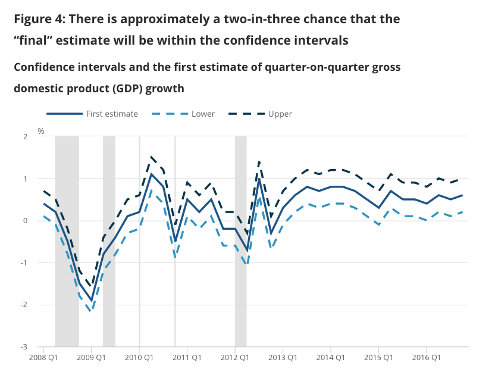
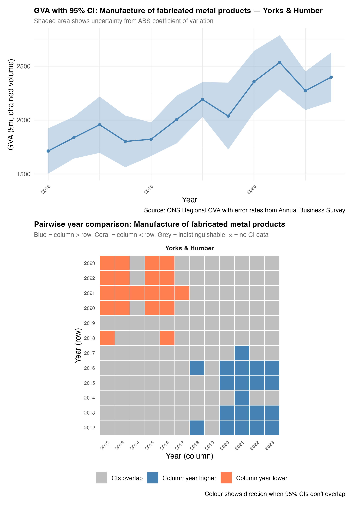
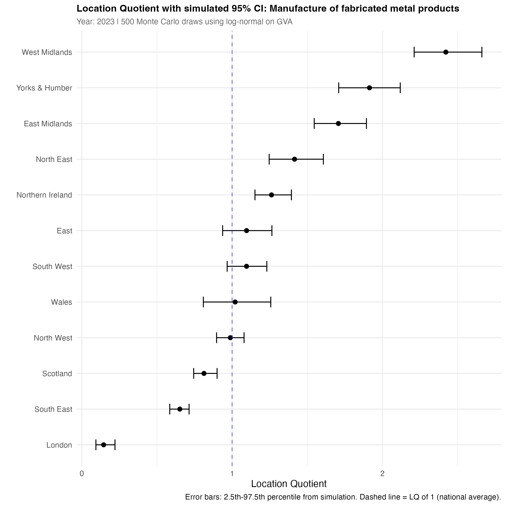

## Report details

-   LLM outputs (I am using Claude Code within the project folder) are kept separate from my own writing here within their own blue breakout boxes. Anything in a blue box is LLM output, not my writing.

## Headlines

-   

-   This is in large part due to the constrictions of the (globally agreed so extremely slow to change) System of National Accounts [@coyle2014].

-   Far from just introducing less precision, including uncertainty leads to some quite different, useful ways of thinking about regions, grounded in what we do and don't know.

-   I might argue - it's more powerful, because it short-circuits many unhelpful ways of thinking about growth and industrial strategy (some built right into the foundation e.g. see the CIA Russia assessment).

## Resources/links

I have prepared two interactive web pages for each of the GVA sources discussed below. I'll refer back to these with links.

1.  [Chained volume GVA](https://danolner.github.io/RegEconWorks/growth_errorgrids_viewer/): What is the growth signal if error rates are included in regional data?

2.  [Current prices GVA](https://danolner.github.io/RegEconWorks/lq-errorbars-viewer/): What happens to location quotients if error rates are included?

## Introduction: how to avoid chasing vampires off cliff edges

In the movie 'The Lost Boys', David and his west-coast vampire buddies [race motorbikes across a misty landscape](https://youtu.be/DP_lSpeK69c?si=klxDzst0hVvV0QlY). Michael (as yet unaware of the blood-drinking habits of his new associates) tries to keep up with them. David eggs Michael on - but then Michael spots the faint beam of a lighthouse, puts two and two together and barely avoids hurtling over a cliff edge.

One might say David was claiming 'incredible certitude' [@manski2020] about the cliff's location. "Don't worry Micheal, there's no cliff. Why would I be racing you otherwise? It's miles away. Definitely."

Had Michael not seen the lighthouse through the fog, he may have made a type II error, believed David's false negative - "no cliff here" - and raced on. (See @tbl-lostboys for a full type I / II error breakdown.)

If there's fog, what you do about that depends on what you think is going on and what else you feel certain about. But the fog itself is information. Without David's certitude, Michael would do the the same as the rest of us - slow down and check his surroundings.

I am of course going to apply this clunky metaphor to regional economic policy. Decisions are being constantly made on the basis of David-level certitude. But what are the implications of that for how we steer through the economic fog? And what would the implications be if we took the fog seriously?

The issue is already well-explored (see below), but there has been little attempt to measure the fog and think through its policy effects at regional level. This is especially vexatious for place-based policies including trying to get a solid grip on industrial strategy. As devolution deepens, the problems will only multiply. We need to better understand what we do and don't know, and what that means for aligning choices.

Reasons this hasn't happened so far usually come down to the complexity of identifying uncertainty in a national accounts framework. It's true that the scale of the task is intimidating and onerous. But we don't have to jump straight in at the deep end. Here, I argue it's useful to explore the implications using some plausible, evidence-based 'if/then' scenarios about regional economic uncertainty. From that, it should be possible to iteratively explore policy implications.

In this opening piece, I lay out the problem with 'incredible certitude' (as others have done before) and then present two examples of what applying uncertainty to regional GVA data could look like.

I then ask some questions about what the policy and decision-making implications could be. I will leave those open to try and get feedback for the next chunk of this work, where I hope to flesh out how much difference uncertainty could make. I'll save some 'decision-making under uncertainty' sources for that section.

Introducing uncertainty doesn't have to mean losing information. In fact it can be the reverse - revealing genuine signal in the noise, like a lighthouse in fog.

## A quick note on attitude

A few words on the spirit of this work, going back to [a point I was mulling back in 2018](https://coveredinbees.org.archived.website/node/485.html) about how we should approach criticism of economic ideas. I've just been re-reading a [2023 post by Richard Murphy](GDP%20are%20an%20honest%20attempt%20to%20do%20something%20that%20is%20conceptually%20and%20technically%20very%20difficult%20–%20and%20there%20are%20honest%20debates%20about%20what%20to%20include%20and%20what%20not%20to%20include.) about [imputed rent](https://en.wikipedia.org/wiki/Imputed_rent) (the rent that would be paid if owner-occupier houses were rented). The post starts with a GOTCHA claim: imputed rent isn't real! "10% of GDP is made up – it simply does not exist in the real world". Just another example, he says, showing how ridiculous national accounts are.

A commenter [replies](https://www.taxresearch.org.uk/Blog/2023/02/14/10-or-gdp-is-made-up-it-simply-does-not-exist-in-the-real-world/#comment-920070):

> I really do wish you’d dial back the language a bit! GDP are an honest attempt to do something that is conceptually and technically very difficult – and there are honest debates about what to include and what not to include.

I want to keep myself firmly grounded in that respect for work done by much smarter people than me, in the ONS and other places, often under extreme pressure (see example below). The ONS has come under immense pressure, while doing phenomenal work with less money and a much harder survey landscape.

## Getting away from perfect sums

National accounts are just that - national - and issues arise straight away from re-purposing those tools for subnational thinking.

Certitude is built into the system of national accounts. Like all accounts, everything has to sum correctly - the ledger of inputs and outputs must all balance exactly. It's a powerful, mature system that has grown to become part of global governance structures. As the latest SNA (2025 front page [says](https://unstats.un.org/unsd/nationalaccount/sna2025.asp), the goal is to:

> "... ensure the compilation of internationally comparable national accounts statistics according to best practice and in a consistent way, allowing policy makers to benchmark their economies."

Methods to produce these accounts are focused at nation-level. As a result, estimating output for sub-regions is usually secondary, and usually a top-down process. This is the case for UK sub-regional data. As the ONS say in their [breakdown](https://www.ons.gov.uk/economy/grossvalueaddedgva/articles/analysisoftheextentofmodellingandestimationinregionalgrossvalueadded/2018-03-28#principal-data-sources-used-in-regional-gross-value-added) of "observed/estimated/modelled components of regional GVA":

> "Each of the components used in the measurement of regional gross value added (GVA) starts with a value for the UK as a whole, which is taken from the latest UK National Accounts Blue Book dataset. We then use the most appropriate available regional indicator to allocate the national total to parts of the UK, in a top-down hierarchical process. In this way we ensure that all of the regions sum to the published UK total and all sub-regions sum to their respective region total."

So this top down approach is an unavoidable outcome of the accounting framework it is part of. The ONS use "hundreds of input datasets to represent individual components of GVA" to achieve this accounting balance - in a separate regional GVA [methods quality document](https://www.ons.gov.uk/economy/grossvalueaddedgva/methodologies/regionalgrossvalueaddedbalancedqmi), they say of this:

> "The complex process by which GVA estimates are produced means that it is not currently possible to define the accuracy of the estimates... for example, through their standard errors. Therefore, the reliability of the estimates is measured by the extent of revisions."

It isn't the complexity that makes uncertainty estimates impossible, though. ONS statisticians would have no problems navigating that challenge. Again - it's the accounting framework they are working in. Outside of that framework, it would be quite possible to examine what error rates were like in any administration or survey sources. For regional data, it wouldn't have to be an either/or - national accounts approaches could sit alongside more bottom-up analyses that include uncertainty and have no need to artificially 'balance'.

Why does this matter? Because policy action is taken on the basis of this certitude. @coyle2017 digs into this issue (open PDF [here](https://www.roiw.org/2017/s2/3.pdf)), discussing the long history of the tiniest GPD shifts having huge political effects. [Here's a recent example](https://www.ons.gov.uk/economy/grossdomesticproductgdp/bulletins/gdpmonthlyestimateuk/november2025) from November 2025. The UK grew by exactly 0.1% in the three months to November 2025. An earlier 0.1% contraction led to predictably mature responses in the press ([BBC example](https://www.bbc.co.uk/news/articles/cwyp7v7r28yo)), with the shadow chancellor accusing the government of having "misled the British public" over what is almost certainly statistical noise.

Coyle explains the trap we've found ourselves in: accounting certainty and political demand for precision (however spurious) keeps us stuck here. But as she says:

> "... neither the degree of underlying uncertainty nor the everyday practice of ignoring it seems sustainable, even though this situation has lasted for decades." [@coyle2017, p.p.228]

Attempts have been made to move away from this spurious precision. The ONS has experimented with some uncertainty, but it isn't from the data itself. It takes this form: "How much have revisions to official numbers moved in the past? What bounds does that imply?" @fig-onsuncertainty is an example of their answer ([source](https://www.ons.gov.uk/economy/grossdomesticproductgdp/articles/communicatinggrossdomesticproduct/2020-04-16)). But this doesn't include any actual sample error. Work has also been done recently on public perceptions of national GDP uncertainty [@galvão2024].

{#fig-onsuncertainty}

This needs more, including: next stage = exploring implications of uncertainty in this data for how we think about econ policy. Could have those open bits in breakout boxes?

GVA at sub-regional level, however, throws up other sets of problems that make spurious accuracy potentially more troublesome. Local and mayoral authorities don't get national-level data support and resources. UK level economic data works at the level it was made for. So when regions are attempting to implement devolved policy - and especially if they've been tasked with driving national industrial strategy at a local level - spurious accuracy leads to potentially following-vampire-over-cliff levels of decision problems.

## Making a data-driven guess about the level of regional GVA uncertainty

This section presents the method and results for making a data-driven educated guess at the level of uncertainty in UK regional-by-sector GVA numbers. The ONS [region by industry GVA data](https://www.ons.gov.uk/economy/grossvalueaddedgva/datasets/nominalandrealregionalgrossvalueaddedbalancedbyindustry) is used for the central estimate output numbers.

The **Annual Business Survey (ABS)** is used to get uncertainty numbers. It is an ideal source for reasonable confidence bounds around regional/sectoral GVA data. It is [designed](https://www.ons.gov.uk/businessindustryandtrade/business/businessservices/methodologies/annualbusinesssurveyqmi) to capture sectoral and regional GVA at a reasonable resolution, and - for the sectors it covers - gets its data direct from firms. It can be matched directly against the region by industry data's ITL1 geographies and most 2-digit sectors.

The ABS is also the most important input into regional GVA numbers. As the ONS [say](https://www.ons.gov.uk/economy/grossvalueaddedgva/articles/analysisoftheextentofmodellingandestimationinregionalgrossvalueadded/2018-03-28#principal-data-sources-used-in-regional-gross-value-added) in their fascinating breakdown (if you're into that kind of thing) of "observed/estimated/modelled components of regional GVA":

> "Of all the data sources used in regional GVA, the ABS has the greatest overall impact, representing around 71% of GVA(P) and 22% of GVA(I)... It includes elements corresponding to all three of the categories of data we wish to analyse: directly collected from businesses operating in a single region; weighted to represent non-sampled businesses; and apportioned to regions from UK-wide company information."

Using the ABS means there is much less reliance on some of the more [heroic assumptions](https://exobrain.coveredinbees.org/attachments/heroic-assumptions/) that go into other aspects of regional GVA, making it a perfect source for this section's question: if the regional GVA data had the same error rates as the ABS, what would it look like and what would the implications for analysis and policy be?

Is this a valid exercise? I"m arguing yes, on the basis of two things. First, there is definitely uncertainty in the GVA data. An educated guess at error rates may be smaller or larger than the true uncertainty, but including it is very likely more accurate than the alternative - working with the point data as if it was the single true value.

Second, seeing what difference error makes - even if there's error in our error - leads to quite different ways of thinking about regional economies and policy. This goes back to the 'chasing vampires off cliffs' point. Introducing uncertainty provides a chance to explore it implications. Incredible certitude cuts off that chance, and lends itself to horse-race / rank style thinking that may be - and I think probably is - serving us less well.

It helps in this case that the ABS is a good survey, with included error rates, that can easily match against the accounts data. For those sectors that match, it's a fair assumption that the ABS reasonably captures its uncertainty.

Another argument against doing this would be straightforwardly methodological: the statistical approach is too basic. I'd argue that's fine for this stage, where the goal is to explore what uncertainty might mean for regional policy. If the principle stands, the statistics can always be improved. As already mentioned, the ONS itself has a wealth of expertise that could achieve this, alongside partners testing the role of uncertainty in policy.

### Using the Annual Business Survey

The publically available ABS sources are broken into the [central estimate data](https://www.ons.gov.uk/businessindustryandtrade/business/businessservices/datasets/uknonfinancialbusinesseconomyannualbusinesssurveyregionalresultssectionsas) and [error data](https://www.ons.gov.uk/businessindustryandtrade/business/businessservices/datasets/uknonfinancialbusinesseconomyannualbusinesssurveyregionalresultsqualitymeasures)[^1] giving GVA values and standard errors at ITL1 geography level and 2-digit SIC sectors. Here, I convert GVA and standard errors from the ABS to coefficients of variation (proportion of error) and then apply them to the regional/sectoral GVA national accounts data at the same geogaphical scale, and where sectors are present in both sources (there are 73 that match once ABS sector categories are processed to match the region/sector data's bespoke SIC list). Only years available across both sources are used - 2012 to 2023.

[^1]: [code/comments here](https://github.com/DanOlner/RegionalEconomicTools/blob/gh-pages/bits_of_code/ABS_error_rates.R) run through combining those two sources. A final joined CSV is [here](https://github.com/DanOlner/RegionalEconomicTools/blob/gh-pages/data/abs_gva_se_combo.csv), to save others the pain, though it's just for GVA, not every ABS value.

Below, I'll explore the implications of these error rates when applied both available types of regional GVA data:

-   Chained volume (CV) data that aims to capture 'real' output changes over time. From these, we can ask, "Did this sector grow or shrink in this place?" (Later, we can do a few other things e.g. was its growth slope really steeper than other places?)
-   Current prices (CP) data, which (being prices as they were in the year they were counted) can be summed, and used to calculate location quotients (LQs) - how concentrated a sector is in each place. This provides a good sense of the how the UK's economic structure changes. We'll have a go at adding error rates to LQs.

### Chained volume GVA: growth over time

Chained volume (CV) data is used to assess real economic change over time, accounting for inflation and quality changes in goods and services. The ONS calculate separate deflators for each sector within each region, with a single year set as the point where the chained volume and 'prices that year' amounts are the same. Other years are adjusted relative to that, for each sector/place combination. (As a result, each sector/place time series must be treated separately and -unlike the current prices data - cannot be summed.)

This section asks how much the growth signal changes for individual sectors in specific ITL1s if error rates are included.

[This interactive web page](https://danolner.github.io/RegEconWorks/growth_errorgrids_viewer/) provides a way to look at the results, for individual sectors across all twelve ITL1 zones.

-   The inclusion of error rates immediately makes it very rare for year-to-year changes to be distinguishable from zero, if looking at individual 2-digit SIC sectors in specific ITL1 zones. So instead, what each grid plot does is compare each year to every other year, to show where each is clearly separable.

-   The assumptions used (on top of the if/then above) are: 95% confidence intervals, and assuming that GVA change isn't clearly present if the possible minimum from one year is lower than the possible maximum from another year (and vice versa). This is a conservative assumption that the true value[^2] could be at both confidence extremes between timepoints.

[^2]: 'True value' being used as shorthand for the cumbersome '95% confidence interval would contain the true value 95% of the time if the survey sample was taken again'. \[ONS source...\]

Let's talk through the default sector in the interactive, fabricated metals, to make more sense of that. Consider the example in @fig-ynhfab (you can see the same data in the interactive by hovering over Yorkshire and Humber to see its growth over time). What this shows:

-   Blue squares in the grid indicate that the column year was clearly higher than the row year it is compared to ('clearly' meaning, as described above, 95% mins and maxes don't overlap).

-   We can see that 2020 to 2023 are clearly higher than the earlier years in the data, from 2012 to 2016, though the high peak in 2021 is the only year consistently separable from others. 2020 to 2023 are years where the confidence interval minimum is separable from the earlier CI maxima.

-   The rest of the grey area is showing that, for the first half of the data from 2012 to 2017 - on the assumptions we have here - no clear growth signal is coming through.

-   Note, the grid is mirrored along the diagonal. So orange squares are showing the same thing in reverse - earlier column years are clearly lower than some later ones.

{#fig-ynhfab}

Looking on the interactive, Scotland shows the opposite pattern, which can be seen from its growth slope in the interactive clearly too - bottom left orange squares indicate clearly lower values in the later part of the data.

@fig-eastmidsfab shows fabricated metals in the East Midlands. While the later value increases appear separable from the low point around 2017, it can't be so easily distinguished from where it was from 2012 to 2016, despite the central estimates looking higher (they could well have been higher in the earlier period and lower in the later one). That is, recent apparent growth could just be a return to the pre-Brexit status quo, not a step change. The difference to @fig-ynhfab is mainly driven by East Midland's larger standard errors - the underlying GVA data is more uncertain in the ABS. Other sources could be explored to triangulate. Have job numbers risen, for instance? What is known about any productivity changes in the sector here?

Several other ITLs for fabricated metals in the interactive are purely grey. Looking at any of those shows combinations of wide error rates and fairly flat change over time, considering the range of those confidence intervals. The apparent drop in the North West after 2017, for example, isn't clearly separable, though it looks strong. Again, other sources could help support or question that apparent change.

{#fig-eastmidsfab}

Within this way of looking, the data signal of the COVID19 pandemic comes straight through for land transport ([view on interactive page](https://danolner.github.io/RegEconWorks/growth_errorgrids_viewer/?sector=Landtransport)), as it does for accommodation ([here](https://danolner.github.io/RegEconWorks/growth_errorgrids_viewer/?sector=Accommodation)) and food services ([here](https://danolner.github.io/RegEconWorks/growth_errorgrids_viewer/?sector=Foodandbeverageserviceactivities)). Other sectors where one might expect a pandemic impact ([arts/entertainment](https://danolner.github.io/RegEconWorks/growth_errorgrids_viewer/?sector=Creativeartsandentertainmentactivities) and [museums/culture](https://danolner.github.io/RegEconWorks/growth_errorgrids_viewer/?sector=Librariesarchivesmuseumsandotherculturalactivities)) are short on data. Mid-pandemic drops show up as an orange 'column year lower than most other years' band. London stands out as the one place that hasn't yet seen bounced back to its pre-pandemic state, remaining significantly lower than other ITL1s.

### Current prices GVA: location quotients

Location quotients (LQs) are an intuitive way to assess the relative strength of sectors in regions. An LQ is the ratio of a sector's proportion of a region's whole economy versus that sector's proportion of the UK as a whole. If, say, fabricated metals is 20% of a sub-region's GVA but only 10% nationally, it is twice as concentrated - the LQ is two[^3].

[^3]: Because (A/B)/(C/D) is equivalent to (A/C)/(B/D), the LQ actually captures two related ways of seeing the same thing: how relatively concentrated sectors are *across a whole geography* like the UK, and how concentrated *within a subgeography* like South Yorkshire they are. (See the desciption and table in the [ONS' older LQ document](https://www.ons.gov.uk/employmentandlabourmarket/peopleinwork/employmentandemployeetypes/datasets/locationquotientdataandindustrialspecialisationforlocalauthorities).)

Current price (CP) GVA data can be used for LQs because (unlike CV) it *can* be summed, as it is just the money value of each sector's output recorded in that year. CP data can't show real growth over time, but it can be used to examine economic structural change - how much a sector/place combination has *relatively* grown in concentration (which could be due to nominal growth in that sector, or other sectors increasing in value faster).

::: {.callout-note appearance="minimal"}
## Location quotient

$$
\text{LQ}_{s,r} = \frac{\text{GVA}_{s,r} \;/\; \text{GVA}_{r}}{\text{GVA}_{s,\text{UK}} \;/\; \text{GVA}_{\text{UK}}}
$$

where $\text{GVA}_{s,r}$ is the GVA of sector $s$ in region $r$, $\text{GVA}_{r}$ is total GVA across all sectors in that region, and $\text{GVA}_{s,\text{UK}}$ and $\text{GVA}_{\text{UK}}$ are the corresponding UK-wide values. An LQ above 1 means the sector is more concentrated in that region than nationally; below 1, less so.
:::

LQs are (in theory) perfect for thinking about regional specialisms, and for comparison and ranking, making them an obvious fit for industrial strategy thinking. But they also carry the "single accurate value" issue over from the underlying GVA data.

Including error rates around an LQ is trickier than for direct GVA because it is a derived value - it doesn't make sense to apply confidence intervals to an LQ directly. The solution used here is to simulate what the range of the underlying GVA values could be using applied uncertainty, and then calculate LQs based on those simulated values.

Each simulation pulls a sample from a normally distributed range based on the standard errors applied from the ABS, adjusted to make sure no negative values arise as these could break the LQ formula. This is then repeated 500 times to produce a range of possible LQs.

[Here is the interactive page](https://danolner.github.io/RegEconWorks/lq-errorbars-viewer/) for looking at the results, starting again with fabricated metals. There are LQs for each ITL1, including 95% confidence intervals (see also @fig-lqfabs). Considering overlapping error rates, East and West Midlands and Yorkshire & the Humber might be seen as one 'high concentration' group not really separable from each other, with London and the South East separately at the 'low concentration' end. West Midlands also appears to have clearly the highest concentration. Other ITL1s are not so separable, and four have error bars crossing zero - if these are reasonable, there is no way to say if fabricated metals is more or less concentrated than the UK average.

{#fig-lqfabs}

The plot also [has an option](https://danolner.github.io/RegEconWorks/lq-errorbars-viewer/?sector=Manufactureoffabricatedmetalproducts&view=twoyear) to compare LQs across five years, between 2017 and 2023. Overlapping error bars suggest the LQ for fabricated metals may not have significantly changed between those year in many places. The East Midlands (real LQ increase), Scotland and the South East (a plausible decrease in both) do suggest genuine structural change over time.

### Highlighting some differences between single point estimates and with uncertainty

This is a brief section that picks a few example sectors and looks at their LQs. It compares the single-point values (the centre dots in the visualisations, which is the data we'd have without any uncertainty) to how introducing error bars may change the findings.

I don't attempt any policy implication statements based on that. See the final section - that is left open for the follow up report, after an attempt to get feedback on this piece.

Before three examples, note what difference the overall error rate can make. Some sectors have very high uncertainty, present in the ABS. The error rates for [construction of buildings](https://danolner.github.io/RegEconWorks/lq-errorbars-viewer/?sector=Constructionofbuildings&view=single), for example, make it clear that any single-point differences need treating with much caution. only the North East (relative growth) and London (shrinking) appear to have a clear signal. This is also true for [food services](https://danolner.github.io/RegEconWorks/lq-errorbars-viewer/?sector=Foodandbeverageserviceactivities&view=single) - huge uncertainty here (seen also in the CV data) also suggests being careful with claims about the service economy from this data.

Error bars for sectors like [arts/entertainment](https://danolner.github.io/RegEconWorks/lq-errorbars-viewer/?sector=Creativeartsandentertainmentactivities&view=single) show uncertainty varying a lot across ITL1s. Clearly there is better ABS data for Wales, the North East and Northern Ireland. Elsewhere, many places are not distinguishable from the UK average concentration. London is also quite uncertain but because it's so concentrated, it's easy to separate.

Here's a quick run-through comparing findings if considering just single point data versus with uncertainty.

-   [Architecture and engineering activities](https://danolner.github.io/RegEconWorks/lq-errorbars-viewer/?sector=Manufactureoffabricatedmetalproducts&view=twoyear):
    -   Single points: East Midlands, the North East and Scotland seem to have lost a lot of concentration over time, while West Midlands, Wales and South West appear to have seen relative growth.
    -   With uncertainty: East Midlands earlier error range makes recent changes difficult to separate; nothing may have changed. Wales' uncertainty is strong in both time periods. The drop in the North East seems large but can't be separated clearly - can we find any other sources to clarify? The only clear stand-out is still Scotland, with what looks like definite relative growth.
-   [Computer programming/consultancy](https://danolner.github.io/RegEconWorks/lq-errorbars-viewer/?sector=Computerprogrammingandconsultancy&view=twoyear):
    -   Single points: a split between places where the sector has relatively grown - North East, Yorkshire/Humber, Northern Ireland and London - with shrinkage in the South West, North West, Scotland, West Midlands, the East of England and the South East.
    -   With uncertainty: the only clear signals are definite relative shrinkage in the South West and strong growth in London. Uncertainty is especially strong in the East Midlands and East of England.
-   [Telecommunications](https://danolner.github.io/RegEconWorks/lq-errorbars-viewer/?sector=Telecommunications&view=twoyear):
    -   A sector, similar to [Information service activities](https://danolner.github.io/RegEconWorks/lq-errorbars-viewer/?sector=Informationserviceactivities&view=twoyear), that has benefited from some more direct firm data, and this shows in the smaller error bars. It is still a different set of stories for single point data versus with uncertainty.
    -   Single points: London, Northern Ireland, East England, East Midlands and the North East have relatively shrunk; many other places have grown.
    -   With uncertainty: only Northern Ireland's shrinkage has a clear signal. Growth signal is also clear only in Scotland, the South West and the West Midlands.

## Discussion and next steps

This end discussion covers two things:

1.  What the next step - thinking through implications for regional economic policy - might look like. That includes asking some open questions.
2.  What else could be done to add uncertainty to economic data.

### Next step: what are the implications for regional economic thinking if we take uncertainty seriously?

How might it change what we do? There are two aspects to this. One: examining how more uncertain data differs to the single-point data and discussing what that could mean. Implications will be best tested at the point decisions are being mulled, including current industrial strategy choices. It is less theoretical, but more iterative and test/learn-oriented.

The three examples included above could be one way of exploring these implications. If these are the differences between single-point and uncertain estimates, what could that mean for thinking through where regional economies really are?

Two: there is a vast body of theoretical work to consider with a "planning under conditions of deep uncertainty" @haasnoot2013 heading. Game-theoretic ideas, Manski's application of minimax regret @stoye2012, a full dive into cybernetic thinking, trying to comprehend decision-making as algedonic (pain/pleasure) signals in a viable system.

Let's return to the 'avoid chasing vampires off cliffs' idea. This 'be afraid of type II errors' approach is embodied in the precuationary principle: "extra precaution is justified when false negatives are worse than false positives" @persson2016. But it's not always that way round - an issue that signal detection theory attempts to grapple with (see e.g. @simchon2026) - as it says [here](https://www.keiseruniversity.edu/signal-detection-theory/), we are trying to detect the signal in the noise and then act appropriately. The potential damage depends on if we think cliff edges are ahead, or if we unnecessarily travel at a snail's pace or go in an entirely wrong direction.

Choices are never binary in the way that type I/II thinking encourages, however. Michael was making constant steering decisions as he proceeded - initially on a 'no cliff ahead' basis until new lighthouse information arrived. This has to be part of the thinking - how to use uncertain data to steer? That does raise cybernetic ideas again, but any theoretical ideas are probably most valuable inside a test/learning context, not set in stone beforehand.

### Possible further uncertainty if... thens

Possible extensions to adding uncertainty to GVA and other economic data could include:

-   Applying the same methods to lower geographies like ITL2 and 3 would require making assumptions about sample size, but - in the same spirit of if/then - that would be entirely doable, and could be simply applied through the sample-to-standard error conversion. It is one extra estimation step away from the work above though (as it would be if we combined sectors).

-   Chained volume data could be used to compare different places to each other. For example, it should be possible to estimate how much more uncertain growth slopes ('compound annual growth rates' i.e. putting straight lines through change over time) could be. This would allow the equivalent question to be answered: "Has this sector in this place really grown more than elsewhere?" (This would build on the 'significance of growth slopes' work I have already done e.g. [here](https://danolner.github.io/RegionalEconomicTools/quarto_docs/Yorkshire_n_Humber_growthslope_catalogue_Nov2025.html), but that just uses standard OLS error rates sometimes with [Newey West](https://en.wikipedia.org/wiki/Newey–West_estimator) applied).

-   Error values are supplied for hours worked from the annual population survey. Combined with the GVA numbers, it would be possible to place uncertainty on productivity numbers.

-   Using other sources to estimate uncertainty in job counts. There's BRES, and also Companies House data - the latter with very large 'sample sizes'.

-   Sensitivity testing around assumptions. There are no single 'correct' answers. The approach above can pull out very clearly strong growth signals, but one could explore less conservative assumptions and compare to other sources. We could also use other statistical methods - for example, there is likely information in the correlation between timepoints in @fig-eastmidsfab's latter high values that could change the picture.

## LLM edits and additions

-   Claude code added the LQ formula and the lines from "where GVA..." to "below 1, less so" in [Current prices GVA: location quotients].
-   ChatGPT made @tbl-lostboys for me, from this prompt. I tweaked some of the text. "Consider the following two bits of text. (1) "Never confuse Type I and II errors again: Just remember that the Boy Who Cried Wolf caused both Type I & II errors, in that order. First everyone believed there was a wolf, when there wasn't. Next they believed there was no wolf, when there was. Substitute "effect" for "wolf" and you're done." And (2) "In the movie 'The Lost Boys', David and his west-coast vampire buddies race motorbikes across a foggy landscape. Michael (unaware of the blood-drinking habits of his new associates) tries to keep up with them. They egg him on - but then he spots the faint beam of a lighthouse, puts two and two together and barely avoids hurtling over a cliff edge. One might say David was claiming 'incredible certitude' (Manski) about the cliff's location. "Don't worry Micheal, it's definitely, definitely miles from here." Can you (1) put the lost boys quote in a type1/2 error context for me? And (2) search for other online sources/links that discuss examples of uncertainty and 'incredible certitude' and their implications?"

## Appendix

::: {#tablelostboys .callout-note appearance="minimal"}
| Reality | Michael believes / acts as if | Error type | The scene |
|------------------|------------------|------------------|------------------|
| **Cliff is NOT near** | "Cliff IS near" (brakes hard, swerves) | **Type I (false positive / false alarm)** | Over-cautious braking when it was actually safe. Embarrassing, slower, but not deadly. |
| **Cliff IS near** | "Cliff is NOT near" (keeps speeding) | **Type II (false negative / missed warning)** | The catastrophic one: he trusts David's "definitely miles away" and goes over the edge. |
| Cliff NOT near | "Cliff NOT near" | Correct | Keeps up, no harm. |
| Cliff IS near | "Cliff IS near" | Correct | Sees the lighthouse, updates belief, avoids disaster. Punches David. |

: The Lost Boys cliff scene in type I / II error form {#tbl-lostboys}
:::
