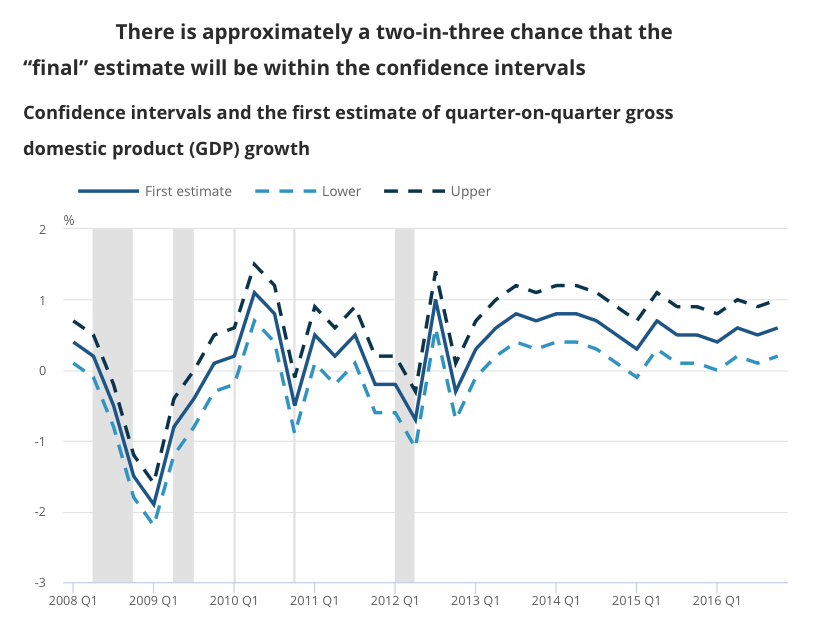
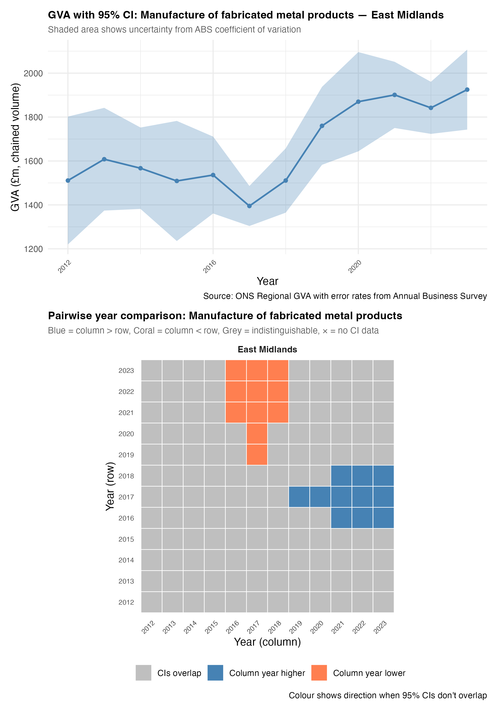
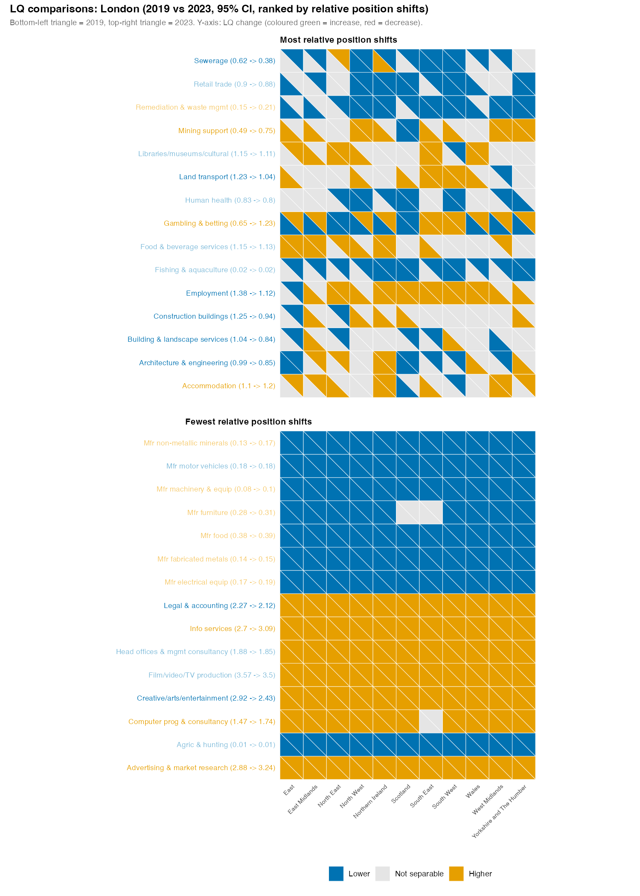
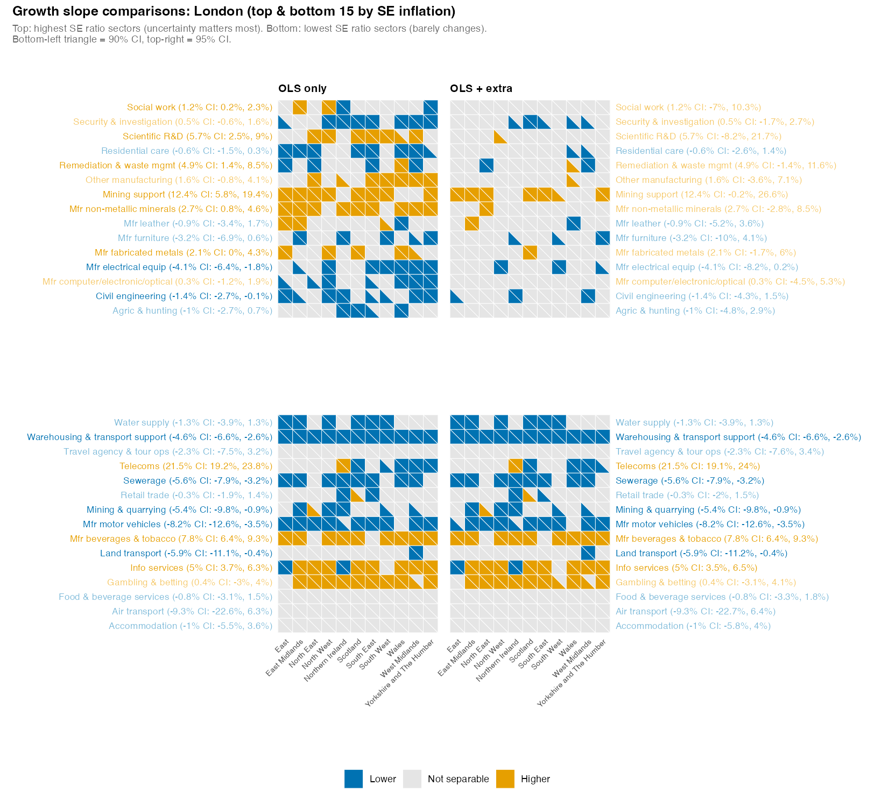

## What's this?

Explain about the tone - half way between formal academic and own voice more blog like, fitting its 'chunk' status. Be brief! Link to blog post.

## Headlines

-   Including uncertainty in UK regional GVA data leads to quite different, useful ways of thinking that aren't possible with point estimates. It allows filtering signal from noise.

-   The ONS [rules out](https://www.ons.gov.uk/economy/grossvalueaddedgva/methodologies/regionalgrossvalueaddedbalancedqmi) error rates for regional GVA as 'too complex' - which it is, within the restrictions of a national accounts framework (globally agreed so extremely slow to change) [@coyle2014]. But it's quite possible to test methods outside those restrictions. Accounts' single point data and error-bar approaches can both be used.

-   This report applies UK Annual Business Survey uncertainty rates to region-by-industry GVA data to explore what the impact of uncertainty could be.

-   It argues uncertainty is powerful because it short-circuits many unhelpful ways of thinking about growth and industrial strategy, including spurious rank-building.

-   This first piece asks questions about what this might mean for regional economic thinking, with the aim of seeking feedback for a follow up article asking: "If we accept uncertainty into regional growth data, what are the decision-making implications?"

## Resources/links

There are three interactive web pages for each of the GVA sources discussed below. I'll refer back to these with links.

1.  [Chained volume GVA](https://danolner.github.io/RegEconWorks/growth_errorgrids_viewer/): What is the growth signal if error rates are included in regional data?

2.  [Current prices GVA](https://danolner.github.io/RegEconWorks/lq-errorbars-viewer/): What happens to location quotients if error rates are included?

3.  [Triangle plot viewer](https://danolner.github.io/RegEconWorks/triangle-plot-viewer/) for both growth slopes of chained volume GVA and LQ differences.

The repository for this project is [here](https://github.com/DanOlner/RegEconWorks). This includes all code (which mostly downloads data directly to be processed) and writing, as well as a record of any Claude-Code conversations used in development. See [this draft set of guidelines](https://exobrain.coveredinbees.org/llm-use-in-work-experimenting-with-short-guidelines/) on how to clearly keep one's own work separable from LLM use, treating it no differently to any other source (with some complications). A section at the end explains how LLMs were (minimally) used in this article and points to other sources outlining how they were (more extensively) used in code production.

------------------------------------------------------------------------

## Introduction: how to avoid chasing vampires off cliff edges

In the movie 'The Lost Boys', David and his west-coast vampire buddies [race motorbikes across a misty landscape](https://youtu.be/DP_lSpeK69c?si=klxDzst0hVvV0QlY). Michael (as yet unaware of the blood-drinking habits of his new associates) tries to keep up with them. David eggs Michael on - but then Michael spots the faint beam of a lighthouse, puts two and two together and barely avoids hurtling over a cliff edge.

One might say David was claiming 'incredible certitude' [@manski2020] about the cliff's location. "Don't worry Micheal, there's no cliff. Why would I be racing you otherwise? It's miles away. Definitely."

Had Michael not seen the lighthouse through the fog, he may have made a type II error: believed David's false negative - "no cliff here" - and raced on. (See @tbl-lostboys for a full type I / II error breakdown of the scene.)

If there's fog, what you do about that depends on what you think is going on and what else you feel certain about. But the fog itself is information. Without David's certitude, Michael would do the the same as the rest of us - slow down, check his surroundings and steer more carefully.

I am of course going to apply this clunky metaphor to regional economic policy. Decisions are being constantly made on the basis of David-level certitude. But what are the implications of that for steering through the economic fog? What if we took the fog seriously? The issue is already well-explored (see below), but there has been little attempt to measure the fog and think through its policy effects at UK regional level (that I have found, let me know if I've missed anything).

This is especially vexatious for place-based policies, including industrial strategy. As devolution deepens, the problems will only multiply. We need to better understand what we do and don't know, how that affects available regional choices, and how policy should or shouldn't align across regions.

Reasons this hasn't happened so far usually come down to the complexity of identifying uncertainty in a national accounts framework. It's true that the scale of the task is intimidating and onerous. But we don't have to jump straight in at the deep end. Here, I argue it's useful to explore the implications using some plausible, evidence-based 'if/then' scenarios about regional economic uncertainty. The uncertainty estimations may be imperfect, but arguably some error in our error is better than false certitude. There are testable ways of working through potential sources of bias.

From that, it should be possible to iteratively explore policy implications.

In this opening piece, I lay out the problem with 'incredible certitude' (as others have done before) and then present two examples of what applying uncertainty to regional GVA data could look like.

I then make some suggestions and ask some questions about what the policy and decision-making implications could be, with a very brief discussion of the theory. I will leave those questions open to try and get feedback for the next chunk of this work: fleshing out how uncertainty could affect regional decision-making.

## A quick note on attitude

A few words on the spirit of this work, going back to [an old argument](https://coveredinbees.org.archived.website/node/485.html) about how we should approach criticism of economic ideas. I've just been re-reading a [2023 post by Richard Murphy](GDP%20are%20an%20honest%20attempt%20to%20do%20something%20that%20is%20conceptually%20and%20technically%20very%20difficult%20–%20and%20there%20are%20honest%20debates%20about%20what%20to%20include%20and%20what%20not%20to%20include.) about [imputed rent](https://en.wikipedia.org/wiki/Imputed_rent) (the rent that would be paid if owner-occupier houses were rented). The post starts with a 'gotcha' claim: "10% of GDP is made up – it simply does not exist in the real world". Just another example, he says, showing how ridiculous national accounts are.

A commenter [replies](https://www.taxresearch.org.uk/Blog/2023/02/14/10-or-gdp-is-made-up-it-simply-does-not-exist-in-the-real-world/#comment-920070):

> I really do wish you’d dial back the language a bit! GDP are an honest attempt to do something that is conceptually and technically very difficult – and there are honest debates about what to include and what not to include.

I want to mirror that respect for work done by much smarter people than me, in the ONS and other places. The ONS has come under immense pressure (see example below) while doing phenomenal work with less money and a much harder survey landscape.

## Getting away from perfect sums

National accounts are a powerful, mature system that has grown to become an essential part of global governance structures. As the latest SNA (2025) front page [says](https://unstats.un.org/unsd/nationalaccount/sna2025.asp), the goal is to:

> "... ensure the compilation of internationally comparable national accounts statistics according to best practice and in a consistent way, allowing policy makers to benchmark their economies."

National accounts are just that - national. Methods are designed around national estimates. Whatever issues those estimates have apply equally to smaller geographies - but re-purposing national accounts methods for UK subregions introduces new problems.

Estimating output for sub-regions is a top-down process @black2025 that divides national values up. As the ONS say in their [breakdown](https://www.ons.gov.uk/economy/grossvalueaddedgva/articles/analysisoftheextentofmodellingandestimationinregionalgrossvalueadded/2018-03-28#principal-data-sources-used-in-regional-gross-value-added) of "observed/estimated/modelled components of regional GVA":

> "Each of the components used in the measurement of regional gross value added (GVA) starts with a value for the UK as a whole, which is taken from the latest UK National Accounts Blue Book dataset. We then use the most appropriate available regional indicator to allocate the national total to parts of the UK, in a top-down hierarchical process. In this way we ensure that all of the regions sum to the published UK total and all sub-regions sum to their respective region total."

This top-down approach is an unavoidable outcome of the point-estimate accounting framework it is part of. The ONS use "hundreds of input datasets to represent individual components of GVA" to achieve this accounting balance - in a separate regional GVA [methods quality document](https://www.ons.gov.uk/economy/grossvalueaddedgva/methodologies/regionalgrossvalueaddedbalancedqmi), they say of this:

> "The complex process by which GVA estimates are produced means that it is not currently possible to define the accuracy of the estimates... for example, through their standard errors. Therefore, the reliability of the estimates is measured by the extent of revisions."

@black2025 et al discuss many of the problems and challenges with this complexity. But it isn't the complexity itself that makes uncertainty estimates impossible. ONS statisticians would have no problems navigating that challenge. It is the complexity that the constriction of national accounts imposes. Chiefly, as with any accounts, everything has to sum correctly - the ledger of inputs and outputs must all balance exactly, across all places and sectors. Outside of that framework, it would be quite possible to examine what error rates were like in any administration or survey sources. For regional data, it wouldn't have to be an either/or - national accounts approaches could sit alongside more bottom-up analyses that include uncertainty and have no need to artificially balance.

Why does this matter? Because policy action is taken on the basis of this certitude. @coyle2017 digs into this issue (open PDF [here](https://www.roiw.org/2017/s2/3.pdf)), discussing the long history of the smallest GDP shifts having huge political effects. [Here's a recent example](https://www.ons.gov.uk/economy/grossdomesticproductgdp/bulletins/gdpmonthlyestimateuk/november2025) from November 2025. Ostensibly, the UK grew by exactly 0.1% in the three months to November 2025. An earlier 0.1% contraction led to predictably mature responses in the press ([BBC example](https://www.bbc.co.uk/news/articles/cwyp7v7r28yo)), with the shadow chancellor accusing the government of having "misled the British public" over what is almost certainly statistical noise.

As Coyle explains, accounting certainty combines with political demand for precision (however spurious) to keep us stuck here. But as she says:

> "... neither the degree of underlying uncertainty nor the everyday practice of ignoring it seems sustainable, even though this situation has lasted for decades." [@coyle2017, p.p.228]

Attempts have been made to move away from this spurious precision. The ONS has experimented with some uncertainty, but it isn't derived from the data itself. It takes this form: "How much have revisions to official numbers moved in the past? What bounds does that imply?" @fig-onsuncertainty is an example of their answer ([source](https://www.ons.gov.uk/economy/grossdomesticproductgdp/articles/communicatinggrossdomesticproduct/2020-04-16)). But this doesn't explicitly include any actual sample error.

{#fig-onsuncertainty}

Work has also been done recently on public perceptions of national GDP uncertainty [@galvão2024] (online [here](https://onlinelibrary.wiley.com/doi/10.1111/jmcb.13044)) which directly tested people's understanding of - and reaction to - uncertainty. Using a variety of error visualisations and approaches, Galvão and Mitchell found strong support for explicitly including well-designed uncertainty information: it increases insight and does not affect trust. Not only do people understand why point estimates can be misleading and why uncertainty can be less so, they find that explicit inclusion of uncertainty can innoculate against confusion:

> "Absent communication of data uncertainty, the public's probabilistic perceptions of GDP data uncertainty are dispersed and inaccurate. When the public is treated with quantitative communication tools, we find that the public's perceptions become better aligned with objective estimates of data uncertainty."

They note how this can affect policy indirectly through public expectations. But if policymakers were affected in the same way, the implications are wider: those 'dispersed and inaccurate' perceptions may feed directly into steering regional economies, creating potential for following-vampire-over-cliff levels of decision problems.

Adding error rates helps because it short-circuits those inaccurate ways of thinking. For example, using national accounts methods lends itself to making ranks of places and perceiving regional economics as a who's up / who's down jostle for position (a problem Professor Richard Harris [has pointed out](https://medium.com/@profrichharris/the-certain-uncertainty-of-university-rankings-6917b40300f2) also happens in university rankings, where he shows it is equally spurious).

This competitive view has deep roots in national accounts approaches, originating as they do in managing wartime economies. This can be seen, for example, in [how national accounts methods were used by the CIA](https://www.cia.gov/readingroom/docs/DOC_0000498181.pdf) to model the U.S/ Soviet economies as part of Cold War strategy. The stakes might not be quite so high in competition between Yorkshire and Lancashire, but point estimates make this kind of thinking difficult to avoid.

There are counter-arguments that point estimates are the only plausible tool in many policy areas such as funding allocation (see the final section below). I am not trying to suggest uncertainty is the only valid tool. But it should be one valid tool, and currently it is one we rarely use in this setting. Including uncertainty points policy toward iterative, slow-test improvements - careful steering in the fog.

## Making a data-driven guess about the level of regional GVA uncertainty

This section presents the method and results for making a data-driven educated guess at the level of uncertainty in UK region-by-sector GVA numbers. The ONS [region by industry GVA data](https://www.ons.gov.uk/economy/grossvalueaddedgva/datasets/nominalandrealregionalgrossvalueaddedbalancedbyindustry) is used for the central estimate numbers.

The **Annual Business Survey (ABS)** is used to get uncertainty values. It is an ideal source for reasonable confidence bounds around regional/sectoral GVA data. It is [designed](https://www.ons.gov.uk/businessindustryandtrade/business/businessservices/methodologies/annualbusinesssurveyqmi) to capture GVA at a reasonable resolution, and - for the sectors it covers - gets its data direct from firms. It can be matched directly against the region by industry data's ITL1 geographies and most 2-digit sectors (when aligned to the ONS' bespoke SIC groupings in the region-by-industry data).

The ABS is also the most important input into regional GVA calculations. As the ONS [say](https://www.ons.gov.uk/economy/grossvalueaddedgva/articles/analysisoftheextentofmodellingandestimationinregionalgrossvalueadded/2018-03-28#principal-data-sources-used-in-regional-gross-value-added) in their detailed breakdown of "observed/estimated/modelled components of regional GVA":

> "Of all the data sources used in regional GVA, the ABS has the greatest overall impact, representing around 71% of GVA(P) and 22% of GVA(I)... It includes elements corresponding to all three of the categories of data we wish to analyse: directly collected from businesses operating in a single region; weighted to represent non-sampled businesses; and apportioned to regions from UK-wide company information."

Using the ABS means there is much less reliance on some of the more [heroic assumptions](https://exobrain.coveredinbees.org/attachments/heroic-assumptions/) that go into other aspects of regional GVA - though it isn't without its own assumptions, a key one being that, for firms with multiple sites across regions, GVA is allocated in proportion to site employment count geographically. But it is still survey-based, making it a perfect source for this section's question: if the regional GVA data had the same error rates as the ABS, what would it look like and what would the implications for analysis and policy be?

Note, single-point GVA values in the ABS can be quite different to the official region-by-industry GVA. @fig-gva_2sources summarises the average percent difference per sector between these two data sources (where single-sector matches exist). This figure is a visual reflection of the differences arising from the top-down national accounts balancing process, compared to survey data; understanding the differences would require a clearer view into the complexity the ONS cite as the barrier to ever including error rates.

(The difference in some sectors are more easily explainable than others, especially mostly public ones. For example, health is 92% lower in the ABS, as the region-by-industry data includes a proxy for public sector output, where GVA is assumed to be just regional job count multiplied by average wage, balanced against national totals. It's thus much higher than the purely 'survey data from private health firms' ABS data).

Why graft the uncertainty from the ABS onto the region-by-industry data, then, rather than just examine ABS GVA? To carry out an 'if/then' exercise that lets us compare to the GVA numbers we *already use* for policy analysis, and ask how uncertainty could change their meaning.

Is this a valid exercise? I"m arguing yes, on the basis of two things. First, there is definitely uncertainty in the GVA data. An educated guess at error rates may be smaller or larger than the true uncertainty, but including it is very likely more accurate than the alternative - working with point data as if they were exact, true values.

Second, seeing what difference error makes provides a way to explore its implications. Incredible certitude cuts off that chance, and as mentioned lends itself to horse-race / rank style thinking that may be serving us poorly.

Another argument against doing this would be straightforwardly methodological, and that has two parts. First, the statistical approach used here is too basic. I'd argue that's fine for this stage, where the goal is to explore what uncertainty might mean for regional policy. If the principle stands, the statistics can always be improved. As already mentioned, the ONS itself has a wealth of expertise that could achieve this, alongside partners testing the role of uncertainty in policy.

Second, this approach does nothing to draw on the complexity of national accounts production. That is part of the point, however. If including uncertainty is useful, it should be possible to refine our understanding of that uncertainty, including other sources used in national accounts balancing. But the task is not to try and re-create national accounts approaches, which have very different purposes. If we want to know what the landscape of regional output really is, that may require its own, more region-friendly, approach.

### Method for using the Annual Business Survey

The publically available ABS sources are broken into the [central estimate data](https://www.ons.gov.uk/businessindustryandtrade/business/businessservices/datasets/uknonfinancialbusinesseconomyannualbusinesssurveyregionalresultssectionsas) and [error data](https://www.ons.gov.uk/businessindustryandtrade/business/businessservices/datasets/uknonfinancialbusinesseconomyannualbusinesssurveyregionalresultsqualitymeasures)[^1] giving GVA values and standard errors at ITL1 geography level and 2-digit SIC sectors. Here, I convert GVA and standard errors from the ABS to coefficients of variation (proportion of error) and then apply them to the regional/sectoral GVA national accounts data at the same geographical scale, and where sectors are present in both sources.

[^1]: [code/comments here](https://github.com/DanOlner/RegionalEconomicTools/blob/gh-pages/bits_of_code/ABS_error_rates.R) run through combining those two sources. A final joined CSV is [here](https://github.com/DanOlner/RegionalEconomicTools/blob/gh-pages/data/abs_gva_se_combo.csv), to save others the pain, though it's just for GVA, not every ABS value.

The region-by-industry GVA data uses bespoke groupings of SIC sectors (different groupings for each geography level, to keep to disclosure requirements). The ABS has single-digit SICs, for those sectors in the survey. In order to match the small number of grouped sectors to the ABS, each sector group (such as SIC sectors 5 to 8, covering four of the five mining/quarrying/fossil fuels sectors in SIC section B) is used to get an average coefficient of variation, weighted by the sector's GVA value from the ABS. There are 73 sectors that match once ABS sector categories are processed in this way. Only years available across both sources are used - 2012 to 2023.

Below, I'll explore the implications of these error rates when applied both available types of regional GVA data:

-   Chained volume (CV) data that aims to capture 'real' output changes over time. With this, we can ask, "Did this sector grow or shrink in this place?"
-   Current prices (CP) data, which (being prices as they were in the year they were counted) can be summed, and used to calculate location quotients (LQs) - how concentrated a sector is in each place. This provides a good sense of the how the UK's economic structure changes. We'll test adding error rates to LQs.

### Chained volume GVA: growth over time

This section asks how much the growth signal changes for individual sectors in specific ITL1s if error rates are included. [This interactive web page](https://danolner.github.io/RegEconWorks/growth_errorgrids_viewer/) provides a way to look at the results, for individual sectors across all twelve ITL1 zones.

Chained volume (CV) data is used to assess real economic change over time, accounting for inflation and quality changes in goods and services. The ONS calculate separate deflators for each sector within each region, with a single year set as the point where the chained volume and 'prices that year' amounts are the same. (How deflator calculations work and their potential effect on uncertainty is a vital topic for a later article.) Other years are adjusted relative to that, for each sector/place combination. As a result, each sector/place time series must be treated separately and -unlike the current prices data - cannot be summed.

The assumptions used to add the ABS error rates to this data (on top of the if/then above) are: 95% confidence intervals, and assuming that GVA change isn't clearly present if the possible minimum from one year is lower than the possible maximum from another year (and vice versa). This is a conservative assumption that the true value[^2] could be at both confidence extremes between timepoints.

[^2]: 'True value' being used as shorthand for the cumbersome '95% confidence interval would contain the true value 95% of the time if the survey sample was taken again'. \[ONS source...\]

The inclusion of error rates immediately makes it very rare for year-to-year changes to be distinguishable from zero, if looking at individual 2-digit SIC sectors in specific ITL1 zones. So instead, what each grid plot does in the visualisations here is compare each year to every other year, to show where each is clearly separable.

Let's talk through the default sector in the interactive (and in @fig-ynhfab): fabricated metals, to make more sense of that. What this shows:

-   The top part of the figure plots the time series with added uncertainty bounds. (You can see the same data in the interactive by hovering over Yorkshire and Humber to see its growth over time.) The grid below that compares each year to every other year.

-   Blue squares in the grid indicate that the column year was clearly higher than the row year it is compared to ('clearly' meaning, as described above, 95% mins and maxes don't overlap).

-   We can see that 2020 to 2023 are clearly higher than the earlier years in the data, from 2012 to 2016, though the high peak in 2021 is the only year consistently separable from others. 2020 to 2023 are years where the confidence interval minimum is separable from the earlier CI maxima.

-   The rest of the grey area is showing that, for the first half of the data from 2012 to 2017 - on the assumptions we have here - no clear growth signal is coming through.

-   Note, the grid is mirrored along the diagonal. So orange squares are showing the same thing in reverse - earlier column years are clearly lower than some later ones.

{#fig-ynhfab}

Looking on the interactive, Scotland shows the opposite pattern, which can be seen from its growth slope clearly too - bottom left orange squares indicate clearly lower values in the later part of the data.

@fig-eastmidsfab shows fabricated metals in the East Midlands. While the later value increases appear separable from the low point around 2017, it can't be so easily distinguished from where it was from 2012 to 2016, despite the central estimates looking higher (they could well have been higher in the earlier period and lower in the later one). That is, recent apparent growth could just be a return to the pre-Brexit status quo, not a step change. The difference to @fig-ynhfab is mainly driven by East Midland's larger standard errors - the underlying GVA data is more uncertain in the ABS. Other sources could be explored to triangulate. Have job numbers risen, for instance? What is known about any productivity changes in the sector here?

Several other ITLs for fabricated metals in the interactive are purely grey. Looking at any of those shows combinations of wide error rates and fairly flat change over time, considering the range of those confidence intervals. The apparent drop in the North West after 2017, for example, isn't clearly separable, though it looks strong.

{#fig-eastmidsfab}

Within this way of looking, the data signal of the COVID19 pandemic comes straight through for land transport ([view on interactive page](https://danolner.github.io/RegEconWorks/growth_errorgrids_viewer/?sector=Landtransport)), as it does for accommodation ([here](https://danolner.github.io/RegEconWorks/growth_errorgrids_viewer/?sector=Accommodation)) and food services ([here](https://danolner.github.io/RegEconWorks/growth_errorgrids_viewer/?sector=Foodandbeverageserviceactivities)). Other sectors where one might expect a pandemic impact ([arts/entertainment](https://danolner.github.io/RegEconWorks/growth_errorgrids_viewer/?sector=Creativeartsandentertainmentactivities) and [museums/culture](https://danolner.github.io/RegEconWorks/growth_errorgrids_viewer/?sector=Librariesarchivesmuseumsandotherculturalactivities)) are short on data. Mid-pandemic drops show up as an orange 'column year lower than most other years' band. London stands out as the one place that hasn't yet bounced back to its pre-pandemic state for land transport, remaining significantly lower than other ITL1s.

### Current prices GVA: location quotients

Location quotients (LQs) are an intuitive way to assess the relative strength of sectors in regions. An LQ is the ratio of a sector's proportion of a region's whole economy versus that sector's proportion of the UK as a whole. If, say, fabricated metals is 20% of a region's GVA but only 10% nationally, it is twice as concentrated in that region - the LQ is two[^3].

[^3]: Because (A/B)/(C/D) is equivalent to (A/C)/(B/D), the LQ actually captures two related ways of seeing the same thing: how relatively concentrated sectors are *across a whole geography* like the UK, and how concentrated *within a subgeography* like South Yorkshire they are. (See the desciption and table in the [ONS' older LQ document](https://www.ons.gov.uk/employmentandlabourmarket/peopleinwork/employmentandemployeetypes/datasets/locationquotientdataandindustrialspecialisationforlocalauthorities).)

Current price (CP) GVA data can be used for LQs because (unlike CV) it *can* be summed, as it is just the money value of each sector's output recorded in that year. CP data can't show real growth over time, but it can be used to examine economic structural change - how much a sector/place combination has *relatively* grown in concentration (which could be due to nominal growth in that sector, or other sectors increasing in value faster).

::: {.callout-note appearance="minimal"}
## Location quotient

$$
\text{LQ}_{s,r} = \frac{\text{GVA}_{s,r} \;/\; \text{GVA}_{r}}{\text{GVA}_{s,\text{UK}} \;/\; \text{GVA}_{\text{UK}}}
$$

where $\text{GVA}_{s,r}$ is the GVA of sector $s$ in region $r$, $\text{GVA}_{r}$ is total GVA across all sectors in that region, and $\text{GVA}_{s,\text{UK}}$ and $\text{GVA}_{\text{UK}}$ are the corresponding UK-wide values. An LQ above 1 means the sector is more concentrated in that region than nationally; below 1, less so.
:::

LQs are (in theory) perfect for thinking about regional specialisms, and for comparison and ranking, making them an obvious fit for industrial strategy thinking. But they also carry the "single accurate value" issue over from the underlying GVA data.

Putting error bars around an LQ is trickier than for direct GVA because it is a derived value - it doesn't make sense to apply confidence intervals to the LQ directly. The solution used here is to simulate what the range of the underlying GVA values could be using the applied uncertainty, and then calculate LQs based on those simulated values.

Each simulation pulls a sample from a normally distributed range based on the standard errors applied from the ABS, adjusted to make sure no negative values arise as these could break the LQ formula. This is then repeated 500 times to produce a range of possible LQs.

[Here is the interactive page](https://danolner.github.io/RegEconWorks/lq-errorbars-viewer/) for looking at the results, starting again with fabricated metals. There are LQs for each ITL1, including 95% confidence intervals (@fig-lqfabs is the same plot for fabricated metals).

Considering overlapping error rates, the North East, East Midlands and Yorkshire & the Humber might be seen as one 'high concentration' group not really separable from each other, with London and the South East separately at the 'low concentration' end. West Midlands looks like it has clearly the highest concentration, above all other ITL1s. Other places in the centre are not so separable, and four have error bars crossing zero - if these are reasonable, there is no way to say if fabricated metals is more or less concentrated than the UK average.

{#fig-lqfabs}

The plot also [has an option](https://danolner.github.io/RegEconWorks/lq-errorbars-viewer/?sector=Manufactureoffabricatedmetalproducts&view=twoyear) to compare LQs across five years, between 2017 and 2023. Overlapping error bars suggest the LQ for fabricated metals may not have significantly changed between those years in many places. The East Midlands (real LQ increase), Scotland and the South East (a plausible decrease in both) do suggest genuine structural change over time.

### Triangle plots for both chained volume and LQ data

This section runs through a way to quickly look at comparisons of LQs and real growth to see which look more reliable, and in the case of the 'real growth' chained volume data, easily compare 'vanilla' growth slopes with and without the extra error.

Let's start with location quotients and [this triangle plot for London's ITL1 zone](https://danolner.github.io/RegEconWorks/triangle-plot-viewer/?region=London&type=lq&years=2019_vs_2023&ranking=shifts) (see also @fig-londonLQs below) comparing LQs between 2019 and 2023. What we have here:

-   Each grid square compares LQs and their uncertainty, for each sector in London with that sector in every other ITL zone (x axis).

-   The bottom-left triangles in each square show if London's LQ in 2019 was lower (blue) or higher (orange)[^4] than that sector in the other ITL1s, or not separable (using a z test to compare the difference between the two LQ values). The top-right triangles show the same for 2023.

-   The 'most relative position shifts' plot in the top half shows the top 15 sectors that saw LQs change between low/high/not separable most often. For example, gambling and betting in London has gone from an LQ of 0.65 to 1.23 (LQ values are on the y axis) between 2019 and 2023, and this shows up in the triangles: many have moved from blue (lower concentration than the other ITL1) to orange (higher). Only the North East continues to have a higher concentration than London.

-   The 'fewest relative position shifts' plot in the lower half shows where LQs remained the most unchanged between 2019 and 2023. The solid blocks of blue and orange are sectors in London that have been consistently either higher or lower concentration there. No other ITL1 has this level of fixed structure over the whole dataset (the [South East](https://danolner.github.io/RegEconWorks/triangle-plot-viewer/?region=London&type=lq&years=2012_vs_2023&ranking=shifts) is closest, though that line of higher LQs to London mostly in manufacturing is telling; [West Midlands](https://danolner.github.io/RegEconWorks/triangle-plot-viewer/?region=London&type=lq&years=2012_vs_2023&ranking=shifts) is third). See also [the 2012 to 2023 comparison](https://danolner.github.io/RegEconWorks/triangle-plot-viewer/?region=London&type=lq&years=2012_vs_2023&ranking=shifts) for London - mostly the same sectors have remained unchanged.

[^4]: These are the two colours most likely to be clearly distinguishable for colour-blind people.

There is also the option to order LQ differences by how many are significantly higher or lower overall. [Here is an example](https://danolner.github.io/RegEconWorks/triangle-plot-viewer/?region=Yorkshire_and_The_Humber&type=lq&years=2012_vs_2023&ranking=sigcount) for Yorkshire and The Humber, comparing LQs between 2012 and 2023, where it's possible to confirm what @fig-lqfabs shows above for fabricated metals. Seventh from the bottom of the top plot, fabricated metal concentration in Yorkshire and The Humber has been consistently more concentrated than most places - except the East Midlands, where the LQs aren't separable (at 95% confidence), and the West Midlands, which - as @fig-lqfabs also confirms - has a definite higher LQ, and did in 2012 too.

{#fig-londonLQs}

Next, we use the triangle plot approach to look at 'real' (inflation/quality adjusted) growth over time (using chained volume data). [This](https://danolner.github.io/RegEconWorks/triangle-plot-viewer/?region=London&type=lq&years=2012_vs_2023&ranking=shifts) is the plot for London; @fig-london-cv-triangleplot shows the output here. Let's talk through this one.

-   This time, the top and bottom triangles in each grid are 'slopes differ at 90% and 95% confidence levels'. 90% is a lower bar - those are the bottom left triangles in each grid square. The stricter 95% level is top right. So for example: looking near the top of the bottom half, warehousing and transport support has each triangle full, across all ITL1 comparators - and they are blue, so slopes are separably lower than those places, at both 90 and 95% levels. This sector does look to have shrunk, and clearly more so than anywhere else. Note in the y axis label, the sector's average yearly change was -4.6%.

-   The top and bottom groups of 15 sectors are ordered by **uncertainty inflation** - that is, how much adding extra uncertainty from ABS could impact confidence in slope differences. The top 15 have the widest uncertainty difference; the bottom 15 have the smallest (so warehousing and transport support looks solidly correct, for example, across both approaches).

-   The top 15 are showing which sectors are most affected by the added uncertainty. To pick a striking sector, where scientific R&D looks to have separably higher growth in London than many other ITL1s (third from top), with added uncertainty, only one slope remains separable (at 90%, from the North West). On the right hand side, showing results with added uncertainty, the y axis label also shows this sector's growth bounds (at 95%) cross zero. Unlike the 'OLS only' result, it's not separable from zero linear growth over the whole dataset.

{#fig-london-cv-triangleplot}

### Old: Highlighting some differences between single point estimates and with uncertainty

This is a brief section that picks three example sectors and looks at their LQs. It compares the single-point values (the centre dots in the visualisations, which is the data we would have without any uncertainty) to how introducing error bars may change the findings.

The choice of sectors is a little arbitrary - picked just to highlight what difference it can make if thinking in single point or error-bar terms. I don't attempt any policy implication statements based on that. See the final section - that is left open for the follow up report, after an attempt to get feedback on this piece.

Before those three examples, note what difference the overall error rate can make. Some sectors have very high uncertainty, carried over from the ABS. The error rates for [construction of buildings](https://danolner.github.io/RegEconWorks/lq-errorbars-viewer/?sector=Constructionofbuildings&view=single), for example, make it clear that any single-point differences need treating with much caution. Only the North East (relative growth) and London (shrinking) appear to have a clear signal. This is also true for [food services](https://danolner.github.io/RegEconWorks/lq-errorbars-viewer/?sector=Foodandbeverageserviceactivities&view=single) - huge uncertainty here (seen also in the CV data) also suggests being careful with claims about the service economy from this data (though this doesn't account for any further data contributions going into the complex national accounts numbers).

Error bars for sectors like [arts/entertainment](https://danolner.github.io/RegEconWorks/lq-errorbars-viewer/?sector=Creativeartsandentertainmentactivities&view=single) show uncertainty varying a lot across ITL1s. Clearly there is better ABS data for Wales, the North East and Northern Ireland. Elsewhere, many places are not distinguishable from the UK average concentration. London is also quite uncertain but because it is so concentrated, it is easy to separate (large effect size, in statistical terms).

Here's a quick run-through comparing findings if considering just single point data versus with uncertainty.

-   [Architecture and engineering activities](https://danolner.github.io/RegEconWorks/lq-errorbars-viewer/?sector=Manufactureoffabricatedmetalproducts&view=twoyear):
    -   **Single points:** East Midlands, the North East and Scotland seem to have lost a lot of concentration over time, while West Midlands, Wales and South West appear to have seen relative growth.
    -   **With uncertainty:** East Midlands' earlier error range makes recent changes difficult to separate; nothing may have changed. Wales' uncertainty is strong in both time periods. The drop in the North East seems large but can't be separated clearly. The only clear stand-out is still Scotland, with what looks like definite concentration growth.
-   [Computer programming/consultancy](https://danolner.github.io/RegEconWorks/lq-errorbars-viewer/?sector=Computerprogrammingandconsultancy&view=twoyear):
    -   **Single points:** there is a split between places where the sector has relatively grown - North East, Yorkshire/Humber, Northern Ireland and London - with shrinkage in the South West, North West, Scotland, West Midlands, the East of England and the South East.
    -   **With uncertainty:** the only clear signals are a definite concentration drop in the South West and strong growth in London. Uncertainty is especially strong in the East Midlands and East of England.
-   [Telecommunications](https://danolner.github.io/RegEconWorks/lq-errorbars-viewer/?sector=Telecommunications&view=twoyear):
    -   A sector, similar to [Information service activities](https://danolner.github.io/RegEconWorks/lq-errorbars-viewer/?sector=Informationserviceactivities&view=twoyear), that has benefited from some more direct firm data, and this shows in the smaller error bars. It is still a different set of stories for single point data versus with uncertainty.
    -   **Single points:** London, Northern Ireland, East England, East Midlands and the North East have relatively shrunk; many other places have grown.
    -   **With uncertainty:** only Northern Ireland's shrinkage has a clear signal. Growth signal is also clear only in Scotland, the South West and the West Midlands.

## Discussion and next steps

> **"We demand rigidly defined areas of doubt and uncertainty."** Vroomfondel, Amalgamated Union of Philosophers, Sages, Luminaries and Other Thinking Persons. (Hitchhiker's Guide to the Galaxy)[^5]

[^5]: The stats / greek crossover being what it is, this quote has been used for the same purpose in [this](https://www.nature.com/articles/s41592-020-01036-9) Nature Methods article, [this PhD thesis](https://wrap.warwick.ac.uk/id/eprint/146107/1/WRAP_Theses_Cockayne_2019.pdf) (p.31), [this](https://medium.com/comet-ml/estimating-uncertainty-in-machine-learning-models-part-1-2bd1209c347c) Medium article, [this](https://labs.mcdb.ucsb.edu/smith/william/sites/labs.mcdb.ucsb.edu.smith.william/files/members/files/biome_-_hhg_to_scientific_literature.pdf) teaching handout and probably many other places. I see no reason not to continue this time-honoured tradition.

This end discussion covers two things:

1.  What the next step - thinking through implications for regional economic policy - might look like. That includes asking some open questions.
2.  What else could be done to add uncertainty to economic data.

### What are the implications for regional economic thinking if we take uncertainty seriously?

Often, we have to work with point estimates. Sometimes, it's optimal to do so. Allocation of funding is an obvious example - whether through the UK Index of Multiple Deprivation at small scale, or European objective 1 funding given to NUTS2 zones with GDP per head below 75% of the EU average (no longer in the UK of course), point estimates seem like the only practical approach. Issues are entirely acknowledged but spurious accuracy is weighed against the 'merit of simplicity' [@bofinger2003 p.p.9], potentially a strong policy advantage if it aids efficiency and legibility.

The closer decisions get to regions, however, the less point estimates hold up. Why? Spuriously accurate point data masks the need for deeper regional knowledge structures that need building bottom-up and connected into decision-making.

Coyle and Muhtar @coyle2023 explore this brilliantly. They identify a structural 'failure to learn' at regional level in the UK. Due to an historic lack of bottom-up development (that they suggest is present in places like Japan and the U.S.) there is an "absence of mechanisms for feedback and learning from local outcomes" which they identify as a "fundamental institutional weakness".

All that the inclusion of error bars does is help face the reality of top-down data (a symptom of the problems Coyle and Muhtar talk about) and the relative immaturity of data/policy sinews below national level. Error makes the fog visible, and so directs us back towards our regions, what we concretely know about them, and how that knowledge is built into the choices we make.

A type I or II error for allocation of centrally allocated money might have profound effects, but if the data arrives top-down in the way GVA does, regions have no say in that anyway. For data that regions can build into their own policy loops, quantitative findings can be sense-checked against deep local expertise.

A more regionalised sense-checking process is precisely what catches mistakes in spuriously accurate top-down data (for example, of the 'x region is growing fastest / x advanced sector is largest in the UK' type) and encourages development of deeper, more devolved knowledge networks.

@johnson2013 argue we have a built-in bias towards type I 'false alarms' mattering more, for good reason:

> "We sometimes think sticks are snakes (which is harmless), but rarely that snakes are sticks (which can be deadly)."

This is embodied in the precautionary principle: "extra precaution is justified when false negatives are worse than false positives" @persson2016. Michael is best using this - it's safer to assume vampire David is leading him off a cliff, even if he isn't.

But the opposite "there is no cliff oh no yes there is" false negative need not be so immediately deadly - the cumulative effect of type II errors can be more insidious. They are often a symptom of how data is used. The 'streetlight effect' captures this perfectly [@kirman1992 p.p.134]. This is like:

> "... the person who, having dropped his keys in a dark place, chose to look for them under a streetlight since it was easier to see there."

False negatives can become systemic when we mistake a data source for reality. Often, we don't know what we don't know, or we do but have no other information to rely on. This can be particular pernicious when hard-to-reach groups are simply not visible (people not in education, employment or training - NEETs - are a prime example).

It is all these issues that spuriously accurate data masks.

The value of Coyle and x's paper is -

looking to theory is the wrong direction

the issue is how to develop

praxis point from below here - theory only gets so far when goal is building the sinews that Coyle and x suggest are flimsy or missing

data is the lifeblood of that, but turn back to region shows that need not be narrowly defined

create much richer, multi-faceted picture - not much use for horse-race policy, but arguably better for building functional devolved knowledge networks able to steer

Two: there is a vast body of theoretical work to consider with a "planning under conditions of deep uncertainty" @haasnoot2013 heading. Game-theoretic ideas, Manski's application of minimax regret @stoye2012, a full dive into cybernetic thinking, trying to comprehend decision-making as algedonic (pain/pleasure) signals in a viable system.

The potential damage depends on if we think cliff edges are ahead, or if we unnecessarily travel at a snail's pace or go in an entirely wrong direction.

, especially type I 'false alarms'.

As with Michael following vampires toward cliff edges, we check surroundings and steer more carefully.

That then lets regions get a better grip on the steering wheel. Reaction to data errors can be more fluid.

Regionally, both false alarms and undetected misses

There isn't a clean answer, only test and learn combined with considering existing theory about decisionmaking in uncertainty. But that can quickly lapse in abstraction - how to keep exploration grounded?

Not to say theory doesn't matter, but theory disconnected from practice can drift into abstraction

If we drop horse-race thinking, it points back towards what we *do* know, and that basket of knowledge is quite a different thing. Quantitative data is part of it, but may not be sufficient by itself.

Implications will be best tested at the point decisions are being mulled, including current industrial strategy choices. It is less theoretical, but more iterative and test/learn-oriented. The three examples included above could be one way of exploring these implications. If these are the differences between single-point and uncertain estimates, what could that mean for thinking through where regional economies really are?

Choices are never binary in the way that type I/II thinking encourages, however. Michael was making constant steering decisions as he proceeded - initially on a 'no cliff ahead' basis until new lighthouse information arrived. This has to be part of the thinking - how to use uncertain data to steer? That does raise cybernetic ideas again, but any theoretical ideas are probably most valuable inside a test/learning context, not set in stone beforehand.

We've had false positives from spuriously accurate data where there were actual errors, both of the ranking type: "this city is the UK's number one for growth" and "this region is the UK's number one advanced cluster for x."

The issue might not be that the ranking was wrong, but that this kind of thinking is fundamentally unproductive. As we can see above, where it's possible to detect signal in the noise, that is useful. But where fog remains, that

### Possible further uncertainty if... thens

Possible extensions to adding uncertainty to GVA and other economic data could include:

-   Applying the same methods to lower geographies like ITL2 and 3 would require making assumptions about sample size, but - in the same spirit of if/then - that would be entirely doable, and could be simply applied through the sample-to-standard error conversion. It is one extra estimation step away from the work above though (as it would be if we combined sectors).

-   Chained volume data could be used to compare different places to each other. For example, it should be possible to estimate how much more uncertain growth slopes ('compound annual growth rates' i.e. putting straight lines through change over time) could be. This would allow the equivalent question to be answered: "Has this sector in this place really grown more than elsewhere?" (This would build on the 'significance of growth slopes' work I have already done e.g. [here](https://danolner.github.io/RegionalEconomicTools/quarto_docs/Yorkshire_n_Humber_growthslope_catalogue_Nov2025.html), but that just uses standard OLS error rates sometimes with [Newey West](https://en.wikipedia.org/wiki/Newey–West_estimator) applied).

-   Error values are supplied for hours worked from the annual population survey. Combined with the GVA numbers, it would be possible to place uncertainty on productivity numbers.

-   Using other sources to estimate uncertainty in job counts. There's BRES, and also Companies House data - the latter with very large 'sample sizes'.

-   Sensitivity testing around assumptions. There are no single 'correct' answers. The approach above can pull out very clearly strong growth signals, but one could explore less conservative assumptions and compare to other sources. We could also use other statistical methods - for example, there is likely information in the correlation between timepoints in @fig-eastmidsfab's latter high values that could change the picture.

------------------------------------------------------------------------

## LLM use

**In this article:**

-   Claude code added the LQ formula and the lines from "where GVA..." to "below 1, less so" in [Current prices GVA: location quotients].
-   ChatGPT made @tbl-lostboys for me, from this prompt. I tweaked some of the text. "Consider the following two bits of text. (1) "Never confuse Type I and II errors again: Just remember that the Boy Who Cried Wolf caused both Type I & II errors, in that order. First everyone believed there was a wolf, when there wasn't. Next they believed there was no wolf, when there was. Substitute "effect" for "wolf" and you're done." And (2) "In the movie 'The Lost Boys', David and his west-coast vampire buddies race motorbikes across a foggy landscape. Michael (unaware of the blood-drinking habits of his new associates) tries to keep up with them. They egg him on - but then he spots the faint beam of a lighthouse, puts two and two together and barely avoids hurtling over a cliff edge. One might say David was claiming 'incredible certitude' (Manski) about the cliff's location. "Don't worry Micheal, it's definitely, definitely miles from here." Can you (1) put the lost boys quote in a type1/2 error context for me? And (2) search for other online sources/links that discuss examples of uncertainty and 'incredible certitude' and their implications?"

**In this project as whole:**

-   The [main R code script here](https://github.com/DanOlner/RegEconWorks/blob/master/code/ABS_error_rates.R) has sections clearly marked where Claude Code (CC) was used to output code. This is mostly for visualisations, but CC also built the Monte Carlo randomisation simulation to get a spread of LQ values.

-   CC was used to output the two HTML/Javascript interactives, built around saved images. The prompt back-and-forth for that process is [here](https://github.com/DanOlner/RegEconWorks/blob/master/llm_convos/llm_convos_from_regecontools/2026-02-09_1356_The_user_opened_the_file_UsersdanolnerCodeRegional.md).

-   CC drafted a first version of the project folder structure that I then tweaked. That built on [this source-synthesis](https://exobrain.coveredinbees.org/ll-moutput/modular-open-publishing-workflow/) from CC on 'modular open publishing workflow'.

-   There is a CC-drafted source summary exploring why the ABI and region-by-industry GVA values differ [here](https://github.com/DanOlner/RegEconWorks/blob/master/llm_output/abs_v_regbyindustry.md).

## Appendix

### Table: Lost Boys cliff scene in type I / II terms

::: {#tablelostboys .callout-note appearance="minimal"}
| Reality | Michael believes / acts as if | Error type | The scene |
|------------------|------------------|------------------|------------------|
| **Cliff is NOT near** | "Cliff IS near" (brakes hard, swerves) | **Type I (false positive / false alarm)** | Over-cautious braking when it was actually safe. Embarrassing, slower, but not deadly. |
| **Cliff IS near** | "Cliff is NOT near" (keeps speeding) | **Type II (false negative / missed warning)** | The catastrophic one: he trusts David's "definitely miles away" and goes over the edge. |
| Cliff NOT near | "Cliff NOT near" | Correct | Keeps up, no harm. |
| Cliff IS near | "Cliff IS near" | Correct | Sees the lighthouse, updates belief, avoids disaster. Punches David. |

: The Lost Boys cliff scene in type I / II error form {#tbl-lostboys}
:::

### Figure: GVA from the ABS versus GVA from the ONS region-by-industry data, average percent difference

```{r}
#| label: fig-gva_2sources
#| fig-cap: "GVA from the Annual Business Survey vs GVA from the ONS region-by-industry data"
#| fig-height: 10

library(tidyverse)

p_pct = readRDS('../../../local/abs_v_regbyindustry_gvapercentplot.rds')

p_pct


```
